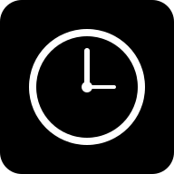

<div align="center">
  

  # ZenFocus

  **A calm, AI-assisted Pomodoro workspace for focused work.**

  Plan the next step, run a focused session, and keep the right background sound in one installable web app.

  [Open ZenFocus](https://timer.nknorman.dpdns.org/) · [Report an issue](https://github.com/LunarithmAI/ZenFocus/issues)
</div>

<p align="center">
  
</p>

## What it does

- **Flexible focus cycles** — configure focus, short-break, and long-break durations, automatic starts, and the long-break interval.
- **Task-centered sessions** — build a task list, select the current task, and keep the session tied to a concrete outcome.
- **AI task breakdown** — turn a large goal into Pomodoro-sized steps with Google Gemini or an OpenAI-compatible endpoint.
- **Focus audio** — play curated Spotify, YouTube, and SoundCloud selections without leaving the workspace.
- **Personal themes** — choose from four bundled backgrounds or add a custom image, then tune blur and dimming.
- **Stay aware** — optional completion sounds, browser notifications, and automatic Picture-in-Picture on supported browsers.
- **Installable PWA** — install ZenFocus from the browser and keep the timer, tasks, settings, and bundled themes available through the offline app shell.

## Quick start

### Requirements

- Node.js 20 or newer
- npm

### Run locally

```bash
git clone https://github.com/LunarithmAI/ZenFocus.git
cd ZenFocus
npm install
npm run dev
```

Open `http://localhost:3000`.

AI assistance is optional; the timer and task workflow work without an API key.

## Configure AI assistance

ZenFocus supports two providers from **Settings → AI Assistant**:

- **Google Gemini** — enter a Gemini API key and model name. The default model is `gemini-2.5-flash`.
- **OpenAI-compatible API** — enter the API key, base URL, and model exposed by your provider.

You can also provide a Gemini key during local development:

```bash
cp .env.example .env.local
```

Then replace the placeholder in `.env.local`:

```dotenv
GEMINI_API_KEY=your_key_here
```

Keys entered in Settings are stored in the browser's local storage. A key supplied through the Vite environment is embedded in the client build. Do not commit keys, and do not treat a client-side key as secret; use a restricted key suitable for browser use.

## Commands

| Command | Purpose |
| --- | --- |
| `npm run dev` | Start the Vite development server on port 3000 |
| `npm run build` | Create a production build in `dist/` |
| `npm run preview` | Serve the production build locally |
| `npm run verify:pwa` | Build and verify the generated PWA assets |

## Offline behavior

After the first successful load, the installed app can serve its shell and bundled themes offline. Focus audio, remote custom backgrounds, and AI providers still require a network connection.

## Built with

- React 19 and TypeScript
- Vite 6
- Tailwind CSS 4
- `vite-plugin-pwa`
- Gemini and OpenAI-compatible REST APIs

## License

ZenFocus is available under the [MIT License](./LICENSE).
